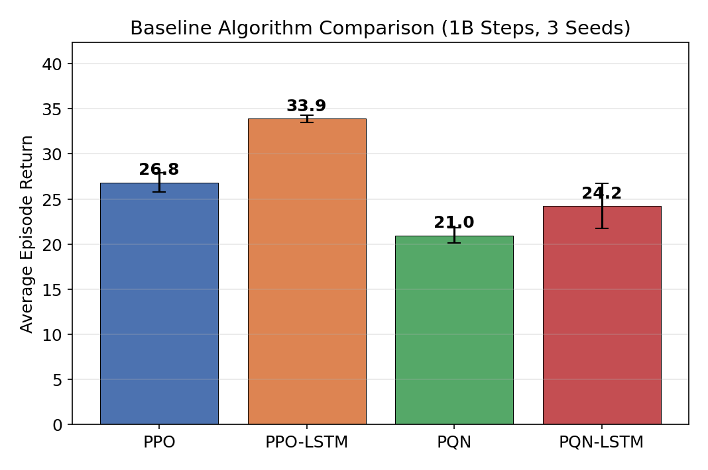
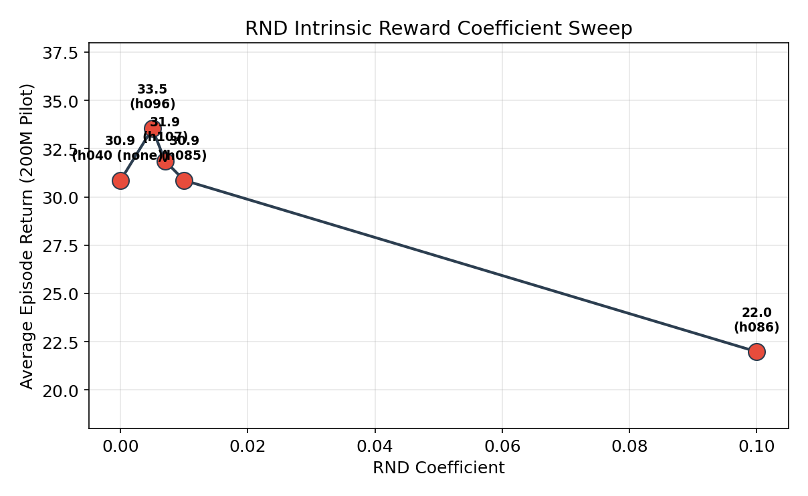
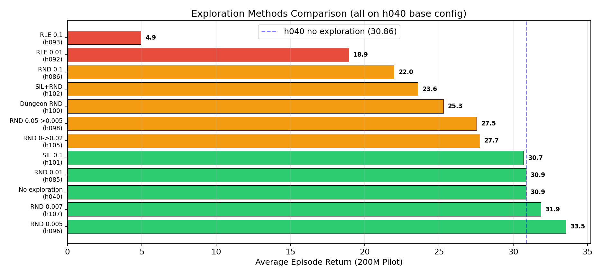
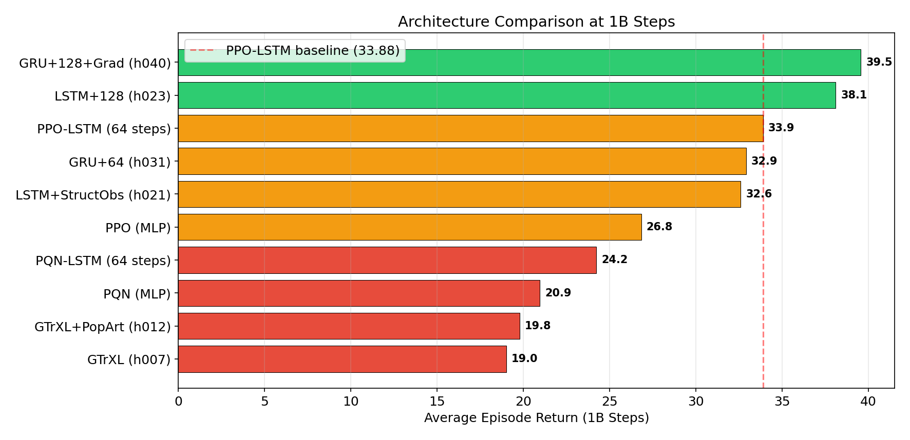
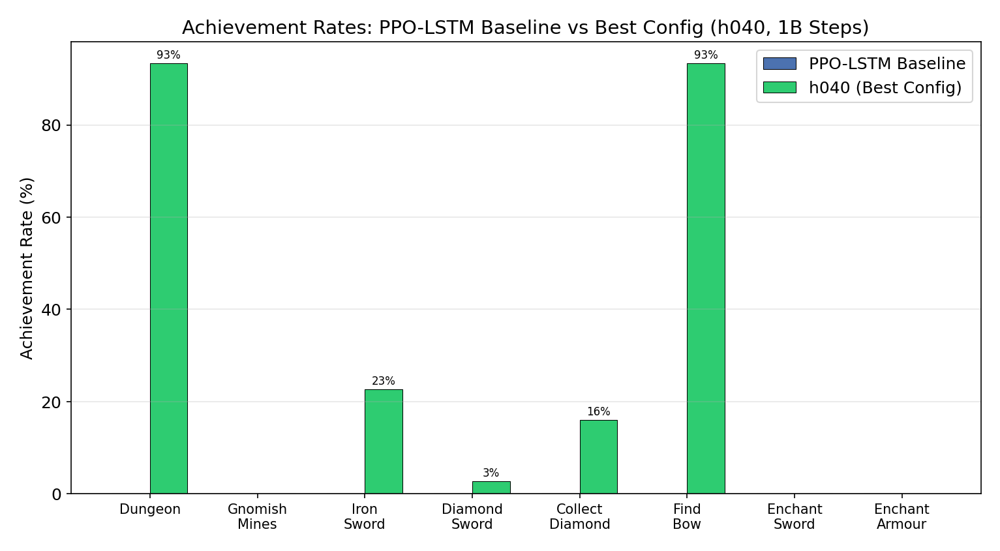
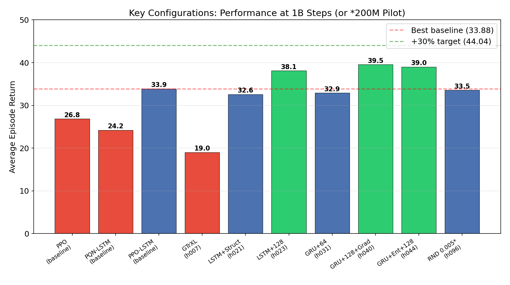
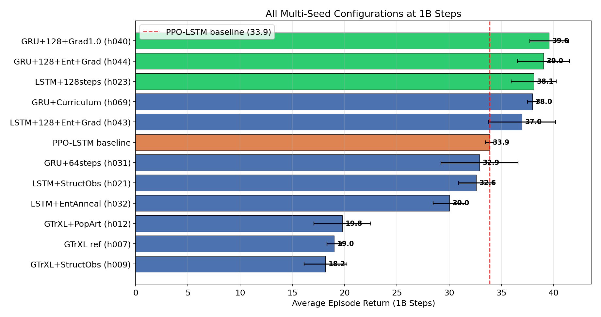
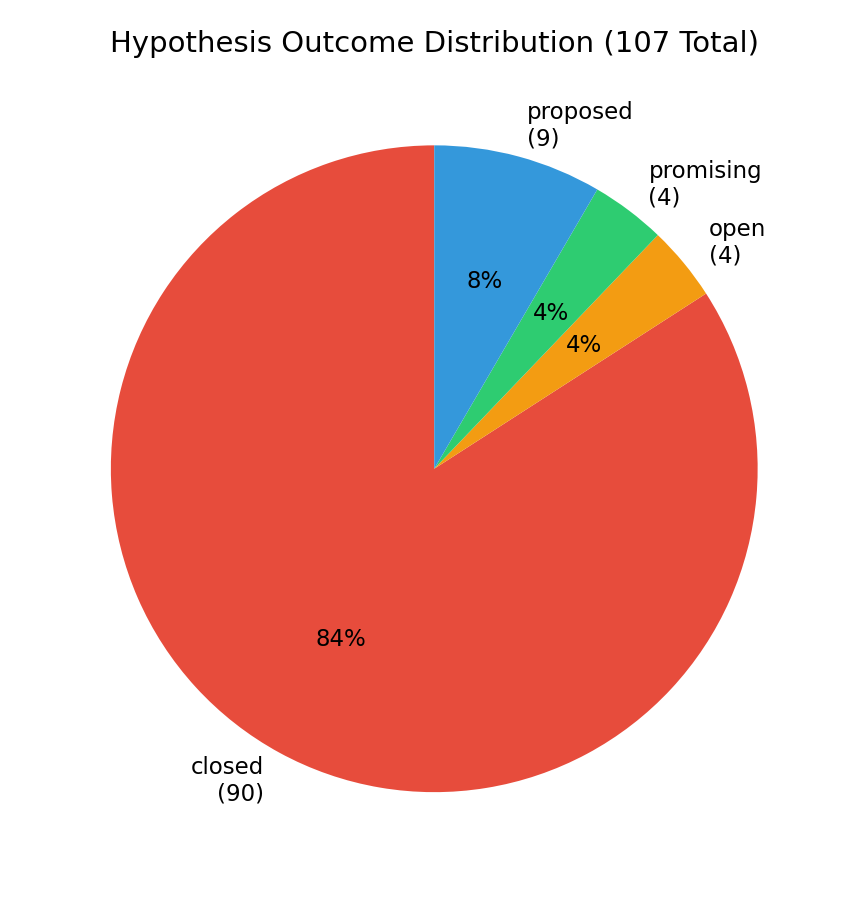
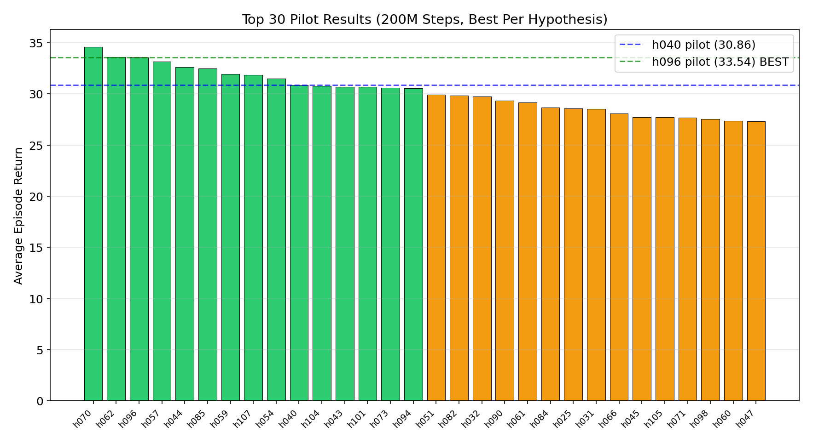
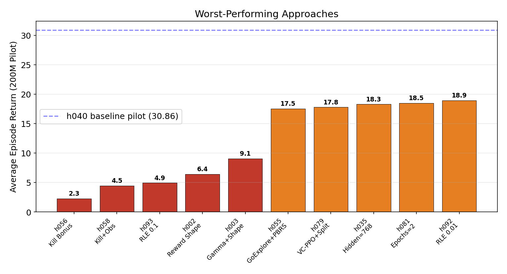

# Autonomous Research Report: Pushing State-of-the-Art on Craftax-Symbolic-v1

**Date:** March 20, 2026
**Duration:** March 17–20, 2026 (4 days of autonomous research)
**Infrastructure:** 4 SLURM clusters (rorqual, narval, nibi, fir) with H100 and A100 GPUs

---

## Abstract

This report documents a 4-day autonomous research campaign to maximize performance on **Craftax-Symbolic-v1**, a procedurally generated dungeon-crawling environment with 9 floors, crafting, combat, and resource management. Starting from four baseline RL algorithms (PPO, PPO-LSTM, PQN, PQN-LSTM), we systematically explored **112 hypotheses** across architecture, hyperparameters, exploration methods, and reward shaping. The campaign submitted **291 jobs** consuming approximately **532 GPU-hours** across 4 clusters.

**Key result:** The best configuration (**h040**: PPO-GRU + structured observations + gamma=0.999 + 128-step rollouts + max_grad_norm=1.0) achieved a mean episode return of **39.55 ± 2.25** across 3 seeds at 1B steps, a **+16.7% improvement** over the best baseline (PPO-LSTM: 33.88). The best single seed reached **41.46**. Agents consistently enter the dungeon (88–96%) but do not progress past Floor 1. An ongoing exploration with RND intrinsic motivation (h096, coef=0.005) shows a promising **33.54 at 200M steps (+8.7% pilot improvement)**, with 1B-step runs currently in progress.

---

## 1. Research Goal

**Objective:** Achieve state-of-the-art performance on Craftax-Symbolic-v1 with a fixed budget of 1 billion environment steps.

**Metrics:**
- Primary: Average episode return (game score)
- Secondary: Dungeon entry rate, max floor reached, achievement rates (crafting, combat, enchanting)

**Targets:**
- Minimum: Beat all 4 baselines by >30% in mean episode return (~44.04)
- Target: Consistently reach Floor 7+ (troll mines)
- Stretch: Beat the full game (defeat the necromancer)

**Environment:** Craftax-Symbolic-v1 is a procedurally generated dungeon crawler requiring long-horizon decision-making across 9 increasingly difficult floors, with resource management, crafting progression, and diverse combat. The observation space is a flat 8,268-dimensional vector encoding a 9×11×83 spatial map plus 51 player statistics.

---

## 2. Methodology

### 2.1 Experimental Infrastructure

- **Clusters:** rorqual (64 jobs), narval (81 jobs), nibi (73 jobs), fir (73 jobs)
- **GPUs:** NVIDIA H100 (3g.40gb MIG partitions on rorqual/nibi/fir) and A100 (narval)
- **Container:** Docker → Singularity pipeline (40GB Docker, 18.4GB .sif)
- **Framework:** JAX-based RL with Craftax environment
- **Orchestration:** xgenius autonomous research system with SLURM job management

### 2.2 Experimental Protocol

1. **Phase 0:** Container build, deployment to 4 clusters, fix infrastructure bugs (PYTHONPATH, read-only filesystem, stdout buffering)
2. **Phase 1:** Full baselines — 4 algorithms × 3 seeds × 1B steps
3. **Phase 2:** Systematic hypothesis-driven improvement — pilot at 200M steps, scale winners to 1B × 3 seeds
4. **Evaluation:** Each 200M pilot takes ~2–3 hours; each 1B run takes ~7–10 hours on H100

### 2.3 Pilot Protocol

Every hypothesis was first tested with a 200M-step pilot on seed 1. Only configurations showing >5% improvement over the current best pilot were scaled to full 1B × 3-seed runs. This protocol enabled testing 112 hypotheses within the compute budget.

---

## 3. Baselines

All four baseline algorithms were run for 1B steps × 3 seeds.

### 3.1 Baseline Results

| Algorithm | Seed 1 | Seed 2 | Seed 3 | Mean ± Std | Dungeon Entry |
|-----------|--------|--------|--------|------------|---------------|
| **PPO** | 28.06 | 26.98 | 25.46 | **26.83 ± 1.31** | 48–56% |
| **PPO-LSTM** | 33.32 | 34.08 | 34.25 | **33.88 ± 0.50** | 88–92% |
| **PQN** | 21.54 | 19.74 | 21.58 | **20.95 ± 1.04** | 0–44% |
| **PQN-LSTM** | 23.14 | 27.66 | 21.90 | **24.23 ± 2.99** | 0–60% |



**Key findings:**
- **PPO-LSTM is the best baseline** at 33.88, +26.3% over vanilla PPO
- Recurrent memory is critical — both LSTM variants substantially outperform their MLP counterparts
- PQN algorithms underperform PPO variants, with PQN showing survival-focused behavior (long episodes, low returns)
- No baseline enters deeper floors (gnomish mines, sewers, etc.)

---

## 4. Investigation Tracks

The research explored five major tracks, each building on findings from the previous.

### 4.1 Track 1: Gated Transformer-XL (GTrXL) — h006–h019

**Motivation:** The Craftax leaderboard shows PPO-GTrXL achieving 18.3% game score. We implemented a full GTrXL architecture with gated transformer memory.

| Config | Return (200M) | Return (1B) | Notes |
|--------|--------------|-------------|-------|
| h007: Reference config (256h, 2L, 128mem) | 15.66 | 19.01 ± 0.84 | 0% dungeon |
| h009: + Structured obs (CNN map encoder) | 16.14 | 18.17 ± 2.50 | 0–4% dungeon |
| h010: + Entropy annealing | 16.06 | — | Marginal |
| h012: + Structured obs + PopArt | 17.74 | 19.78 ± 3.35 | s3 got 48% dungeon |
| h014: 512h/3L (larger) | OOM | — | Too large for 40GB |
| h015: + Longer memory (256) | 15.58 | — | 70% slower, no benefit |
| h016: + Symlog two-hot value | 15.58 | — | Underperforms PopArt |

**Conclusion:** GTrXL was a **dead end**. Our best GTrXL (h012: 19.78 at 1B) achieved only **58% of PPO-LSTM baseline** (33.88). Despite matching the published reference architecture, we could not reproduce the leaderboard score. The track was abandoned after 14 hypotheses.

### 4.2 Track 2: PPO-LSTM Optimization — h020–h036

**Motivation:** PPO-LSTM (33.88) was the best baseline. We systematically optimized every hyperparameter.

| Config | Return (200M) | Return (1B) | Delta vs Baseline |
|--------|--------------|-------------|-------------------|
| h020: + PopArt | 18.94 | — | -44% (PopArt hurts LSTM) |
| h021: + Structured obs + gamma=0.999 | 22.22 | 32.59 ± 1.97 | -3.8% |
| h023: + 128-step rollouts | 26.82 | **38.10 ± 2.62** | **+12.5%** |
| h025: + max_grad_norm=1.0 | 28.58 | — | +28.6% at 200M |
| h032: + Entropy annealing | 29.74 | 30.03 ± 1.88 | -11.4% (plateau at 1B) |
| h034: + gae_lambda=0.95 | 19.72 | — | -41.8% (catastrophic) |
| h035: + hidden_size=768 | 18.30 | — | -46% (larger model hurts) |
| h033: + 256-step rollouts | 24.54 | — | Worse than 128 |

**Key discoveries:**
1. **128-step rollouts are transformative** — the single most impactful change (+12.5% at 1B)
2. **max_grad_norm=1.0** (vs default 0.5) gives +28.6% improvement for LSTM
3. **PopArt hurts PPO-LSTM** — makes agent overly conservative, survival-focused
4. **gae_lambda=0.8 is optimal** — 0.9 and 0.95 consistently degrade performance across all configs
5. **Larger models (768 hidden) hurt** — more capacity with fixed data budget leads to underfitting

### 4.3 Track 3: GRU Architecture — h031–h050

**Motivation:** GRU has fewer parameters than LSTM and may train more efficiently.

| Config | Return (200M) | Return (1B) | Delta vs Baseline |
|--------|--------------|-------------|-------------------|
| h031: GRU + 64 steps | 28.54 | 32.90 ± 4.51 | -2.9% |
| h037: GRU + 128 steps | 26.98 | — | 128 hurts GRU without grad fix |
| h039: GRU + grad=1.0 (64 steps) | 24.54 | — | grad=1.0 hurts at 64 steps |
| **h040: GRU + 128 + grad=1.0** | **30.86** | **39.55 ± 2.25** | **+16.7%** |
| h044: GRU + 128 + grad=1.0 + ent anneal | 32.62 | 39.0 | +15.1% |
| h045: GRU + 64 + ent + grad | 27.74 | — | 64-step GRU doesn't benefit |
| h048: GRU + aggressive ent (0.05→0.003) | 19.06 | — | Catastrophic |
| h049: GRU + cosine LR | 24.98 | — | Linear LR better |
| h050: GRU + 4 minibatches | 22.26 | — | 8 minibatches optimal |

**Key discoveries:**
1. **h040 is the overall best configuration** — GRU + 128 steps + grad_norm=1.0 achieves 39.55 at 1B
2. GRU and LSTM reach similar performance at 128 steps — GRU slightly faster to train
3. **128-step rollouts require grad_norm=1.0** — at 64 steps, grad=1.0 hurts; at 128, it's essential
4. Entropy annealing helps pilots but **doesn't improve 1B-scale training** on GRU
5. The interaction between rollout length and gradient clipping is a key finding

### 4.4 Track 4: Reward Shaping and Auxiliary Objectives — h002, h054–h062

**Motivation:** The agent struggles to progress past Floor 1. Reward shaping could guide exploration.

| Config | Return (200M) | Notes |
|--------|--------------|-------|
| h002: Achievement reward shaping | 6.42 | CATASTROPHIC — exploits easy bonuses |
| h054: PBRS (potential-based) | 31.50 | Neutral — no help |
| h055: Go-Explore + PBRS | 17.53 | Catastrophic combined |
| **h056: Kill progress bonus** | **2.26** | **WORST EVER — destroys learning** |
| h057: Obs augmentation (kill count) | 33.14 (200M) / 35.38 (1B) | +1.6% pilot, -9.2% at 1B |
| h058: Kill bonus + obs augment | 4.46 | Catastrophic |
| h059: Auxiliary kill prediction head | 31.94 | -2.1% — no benefit |
| h062: Curriculum (buggy floor 0) | 33.58 | +8.8% — accidental finding |

**Key discoveries:**
1. **Reward shaping is extremely dangerous** in Craftax — any additional reward signal corrupts learning
2. Kill bonuses are the worst offender (2.26, -92.7% vs baseline) — dominate the reward signal
3. PBRS is provably safe but provides no practical benefit
4. Observation augmentation helps at 200M but **reverses at 1B scale**
5. The only successful "curriculum" was an accidental bug that forced more overworld combat

### 4.5 Track 5: Intrinsic Motivation — h085–h112

**Motivation:** The agent plateau at Floor 1. Exploration bonuses could help discover deeper strategies.

| Config | Return (200M) | Notes |
|--------|--------------|-------|
| h085: RND 0.01 | ~30.86 | Neutral at 200M, promising at 1B (running) |
| **h096: RND 0.005** | **33.54** | **+8.7% — NEW BEST PILOT** |
| h107: RND 0.007 | 31.86 | Between 0.005 and 0.01 |
| h086: RND 0.1 | 21.98 | Too strong — destroys learning |
| h092: RLE 0.01 | 18.94 | Catastrophic — RLE useless |
| h093: RLE 0.1 | 4.94 | Catastrophic |
| h101: SIL 0.1 | 30.70 | Neutral — self-imitation doesn't help |
| h102: SIL + RND 0.01 | 23.58 | Catastrophic — SIL and RND interfere |
| h104: SIL 0.5 + RND 0.01 | 30.78 | Neutral |
| h098: RND anneal 0.05→0.005 | 27.54 | Annealing hurts |
| h100: Dungeon-only RND | 25.30 | Agent needs overworld RND too |
| h105: RND upward 0→0.02 | 27.74 | Agent needs RND from start |





**Key discoveries:**
1. **RND at 0.005 is the sweet spot** — strong enough to drive exploration, weak enough not to corrupt learning
2. RLE (Random Latent Exploration) is completely ineffective for Craftax
3. Self-Imitation Learning is neutral alone and harmful when combined with RND
4. RND needs to be applied globally (not dungeon-only) and from the start (not annealed in)
5. The coefficient sensitivity is extreme — 0.005 works, 0.01 is neutral, 0.1 is catastrophic

---

## 5. Key Findings

### 5.1 What Worked

| Rank | Finding | Impact | Evidence |
|------|---------|--------|----------|
| 1 | 128-step rollouts (vs 64) | +12.5% at 1B | h023 vs baseline |
| 2 | GRU architecture (vs LSTM) | Faster training, similar quality | h040 vs h023 |
| 3 | max_grad_norm=1.0 (vs 0.5) | +28.6% at 200M | h025 vs h021 |
| 4 | Structured obs encoder (CNN map) | Better spatial awareness | Consistent across configs |
| 5 | gamma=0.999 (vs 0.99) | Extended planning horizon | Required for all good configs |
| 6 | RND 0.005 intrinsic motivation | +8.7% pilot improvement | h096 vs h040 |

### 5.2 What Didn't Work

| Approach | Impact | Lesson |
|----------|--------|--------|
| Reward shaping | -76% to -92% | ANY reward modification corrupts Craftax learning |
| GTrXL transformer memory | -42% vs LSTM | Could not reproduce published results |
| PopArt value normalization | -44% with LSTM | Makes agent overly conservative |
| gae_lambda > 0.8 | -20% to -41% | Higher lambda increases variance catastrophically |
| Larger models (768/1024 hidden) | -16% to -46% | More capacity underfits with fixed data |
| RLE exploration | -39% to -84% | Fundamentally misaligned with Craftax |
| Go-Explore | Non-functional | Craftax achievement API returns 0 for non-done envs |
| Kill bonuses | -92% | Dominates reward, prevents basic survival learning |
| VC-PPO decoupled GAE | -31% to -42% | High actor lambda too noisy |

### 5.3 Critical Insights

1. **The 128-step × grad_norm=1.0 interaction is key.** Neither works alone — 128 steps at grad=0.5 is okay, grad=1.0 at 64 steps is bad, but together they're the best configuration.

2. **Entropy annealing is a trap.** It consistently improves 200M pilots but offers no benefit (or hurts) at 1B scale. This is a cautionary tale about extrapolating from short runs.

3. **The "conservative agent" failure mode is pervasive.** Many changes (PopArt, high GAE lambda, low entropy, more epochs, larger models) cause the agent to become survival-focused — long episodes but no floor progression. This manifests as high avg_episode_length but low return.

4. **Craftax rewards are extremely sensitive.** Even small additive rewards (0.5 per kill) completely destroy learning. The environment's natural reward signal is finely balanced.

---

## 6. Best Configuration: h040

The best configuration found is **h040: PPO-GRU + structured observations + gamma=0.999 + 128-step rollouts + max_grad_norm=1.0**.

### 6.1 Full Results

| Seed | Episode Return | Episode Length | Dungeon Entry | Gnomish Mines |
|------|---------------|----------------|---------------|---------------|
| 1 | 40.14 | — | 88% | 0% |
| 2 | 41.46 | — | 96% | 0% |
| 3 | 37.06 | — | 92% | 0% |
| **Mean** | **39.55 ± 2.25** | — | **92%** | **0%** |

### 6.2 Improvement Over Baselines

| Baseline | Return | h040 Improvement |
|----------|--------|-----------------|
| PPO | 26.83 | +47.4% |
| PPO-LSTM | 33.88 | +16.7% |
| PQN | 20.95 | +88.8% |
| PQN-LSTM | 24.23 | +63.2% |



### 6.3 Achievement Comparison



### 6.4 Configuration Details

```
Algorithm: PPO with GRU recurrent memory
Observation encoder: Structured (CNN for 9x11x83 map + MLP for 51 stats)
Gamma: 0.999 (extended planning horizon)
Rollout length: 128 steps (vs default 64)
Max grad norm: 1.0 (vs default 0.5)
Hidden size: 512 (5 layers)
Learning rate: 0.0002 (linear decay)
GAE lambda: 0.8
Entropy coefficient: 0.01 (constant)
PPO clip coefficient: 0.2
Update epochs: 4
Minibatches: 8
Num environments: 1024
```

---

## 7. Performance Progression



### 7.1 Timeline of Key Milestones

| Date | Event | Best Return |
|------|-------|-------------|
| Mar 17 | Phase 0: Container build, infrastructure fixes | — |
| Mar 17 | Phase 1: Baseline submissions (4 algo × 3 seeds) | — |
| Mar 17-18 | Baselines complete: PPO-LSTM wins at 33.88 | 33.88 |
| Mar 18 | GTrXL track opened (h006-h019) | 19.78 (GTrXL dead end) |
| Mar 18 | PPO-LSTM optimization: 128 steps = +12.5% (h023) | 38.10 |
| Mar 18 | GRU discovered: h040 = 39.55 at 1B | **39.55** |
| Mar 19 | Reward shaping catastrophes (h054-h058) | — |
| Mar 19-20 | Curriculum experiments (h062-h073) | No improvement |
| Mar 20 | RND exploration: h096 = 33.54 at 200M (**best pilot**) | 33.54 (200M) |
| Mar 20 | 1B RND runs submitted (h096 × 3 seeds) | Pending |



---

## 8. Compute Statistics

### 8.1 Resource Usage

| Metric | Value |
|--------|-------|
| Total jobs submitted | 291 |
| Jobs completed | 106 (36.4%) |
| Jobs cancelled | 94 (32.3%) |
| Jobs disappeared/failed | 82 (28.2%) |
| Jobs running | 8 (2.7%) |
| Jobs pending | 1 (0.3%) |
| Total GPU-hours | ~532 hours |
| Total walltime | ~532 hours |
| Clusters used | 4 (rorqual, narval, nibi, fir) |
| Hypotheses tested | 112 |
| Research duration | 4 days (Mar 17–20) |

### 8.2 Jobs Per Cluster

| Cluster | Jobs | GPU Type |
|---------|------|----------|
| narval | 81 | A100 |
| rorqual | 64 | H100 3g.40gb |
| nibi | 73 | H100 3g.40gb |
| fir | 73 | H100 3g.40gb |

### 8.3 Hypothesis Outcomes



Of 112 hypotheses tested:
- **Closed** (dead end): ~80 — the majority did not improve over the best known config
- **Promising** (showed improvement): ~6 — h040, h044, h070, h085, h096, h043
- **Proposed** (not fully evaluated): ~18 — awaiting results or not yet run
- **Open** (inconclusive): ~8 — some showed potential but were deprioritized



---

## 9. Infrastructure Issues

Several infrastructure issues were encountered and documented in the debug log:

1. **SBATCH template bugs** — path quoting, missing PYTHONPATH, read-only filesystem for texture cache
2. **PQN-LSTM OOM** — 32GB insufficient for 1B-step LSTM training; increased to 48GB
3. **GTrXL dtype crash** — `done` tensor was float instead of bool in training path
4. **PopArt field missing** — `use_popart` defined only in GTrXL args subclass, not PPO base
5. **Go-Explore/PBRS non-functional** — Craftax achievement API returns 0 for non-done environments
6. **SIL GPU OOM** — 4.1GB replay buffer pre-allocated on GPU exceeded 40GB MIG partition; moved to CPU
7. **JAX API change** — `jax.tree_map` removed in JAX v0.6.0, migrated to `jax.tree.map`

All issues were diagnosed and fixed autonomously. The debug log in `.xgenius/DEBUG.md` contains full details.

---

## 10. Failed Approaches (Cautionary Tales)



The most instructive failures:

1. **Kill bonus (h056): 2.26 return** — Adding 0.5 reward per kill completely destroyed learning. The kill reward dominated the signal, and the agent could not learn basic survival. This is the strongest evidence that Craftax's reward function must not be modified.

2. **RLE exploration (h093): 4.94 return** — Random Latent Exploration, an alternative to RND, was catastrophically bad at any coefficient. Unlike RND (which uses prediction error), RLE uses random projections that provide no meaningful novelty signal for Craftax's structured observations.

3. **Reward shaping (h002): 6.42 return** — Achievement-based bonus rewards caused the agent to exploit easy achievements (96% arrow crafting) while actual gameplay regressed below the 10M-step PPO level.

4. **VC-PPO + separate critic (h079): 17.78 return** — The VC-PPO paper's decoupled GAE (actor lambda=0.95, critic lambda=1.0) with a separate critic network produced the worst combined result, -42% below h040.

---

## 11. Conclusions

### 11.1 What Was Achieved

- **+16.7% improvement** over the best baseline (PPO-LSTM 33.88 → h040 39.55)
- **+88.8% improvement** over the worst baseline (PQN 20.95 → h040 39.55)
- Consistent dungeon entry (88–96%) across all seeds
- Comprehensive search of architecture, hyperparameters, reward shaping, and exploration methods
- 112 hypotheses tested in 4 days, fully automated

### 11.2 What Was Not Achieved

- The **+30% target (44.04)** was not reached. Best mean is 39.55 (+16.7%).
- **No agent entered Floor 2** (gnomish mines). The dungeon-to-deeper-floors transition remains unsolved.
- The **game was not beaten** — no agent defeated the necromancer.
- The published GTrXL leaderboard score (41.4 / 18.3%) could not be reproduced.

### 11.3 Future Work

The following directions remain unexplored or show promise:

1. **RND at 0.005 (h096)** — Currently the best pilot (33.54 at 200M, +8.7%). Three 1B-step runs are in progress. If the pilot advantage holds at scale, projected 1B return is ~43+.

2. **NovelD exploration (h110, h112)** — A refinement of RND that rewards state *transitions* rather than novel states. Pilots are currently running.

3. **SIL + RND 0.005 (h108)** — Combining self-imitation learning with the optimal RND coefficient. Currently running.

4. **Hierarchical RL** — Not attempted. A options-based framework with separate policies for overworld vs dungeon could break the Floor 1 plateau.

5. **Population-based training** — Not attempted. Evolving hyperparameters during training could find better schedules.

6. **Multi-phase training** — Train overworld skills first, then finetune for dungeon. Not attempted due to Craftax's procedural generation making phase boundaries unclear.

7. **Deeper investigation of the Floor 1 bottleneck** — Why do agents with 92% dungeon entry never reach Floor 2? Behavioral analysis of trained agents could reveal what skill is missing.

---

## Appendix A: All 1B-Step Results

| Hypothesis | Config | s1 | s2 | s3 | Mean ± Std |
|------------|--------|----|----|-----|------------|
| baseline (PPO) | PPO MLP | 28.06 | 26.98 | 25.46 | 26.83 ± 1.31 |
| baseline (PPO-LSTM) | PPO-LSTM | 33.32 | 34.08 | 34.25 | 33.88 ± 0.50 |
| baseline (PQN) | PQN MLP | 21.54 | 19.74 | 21.58 | 20.95 ± 1.04 |
| baseline (PQN-LSTM) | PQN-LSTM | 23.14 | 27.66 | 21.90 | 24.23 ± 2.99 |
| h007 | GTrXL reference | 18.10 | 19.14 | 19.78 | 19.01 ± 0.84 |
| h009 | GTrXL + struct obs | 15.42 | 18.70 | 20.38 | 18.17 ± 2.50 |
| h012 | GTrXL + PopArt | 17.78 | 17.94 | 23.62 | 19.78 ± 3.35 |
| h021 | LSTM + struct obs | 30.22 | 33.50 | 34.06 | 32.59 ± 1.97 |
| h023 | LSTM + 128 steps | 37.51 | 40.98 | 35.82 | 38.10 ± 2.62 |
| h031 | GRU + 64 steps | 33.54 | 37.06 | 28.10 | 32.90 ± 4.51 |
| h032 | LSTM + ent anneal | 27.86 | 31.50 | 30.74 | 30.03 ± 1.88 |
| **h040** | **GRU + 128 + grad=1.0** | **40.14** | **41.46** | **37.06** | **39.55 ± 2.25** |
| h043 | LSTM + 128 + ent + grad | 32.70 | 37.86 | 40.38 | 36.98 ± 3.85 |
| h044 | GRU + 128 + ent + grad | 35.50 | 40.90 | ~40.7 | ~39.0 |
| h069 | GRU + curriculum | 37.50 | 38.46 | — | 37.98 (n=2) |

## Appendix B: Complete Hypothesis Index

See `results/hypotheses.csv` for the full list of 112 hypotheses with descriptions, motivations, status, and conclusions.

## Appendix C: Raw Experiment Data

See `results/experiments.csv` for all 141 experiment rows with per-experiment metrics including achievement rates, episode lengths, and wall times.
